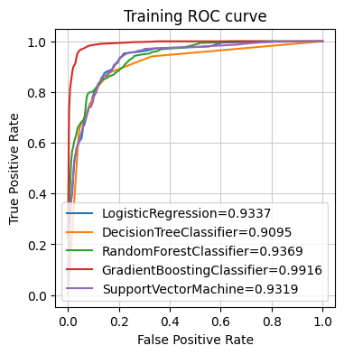

# Heart Failure Prediction 

## Project Overview

Cardiovascular diseases (CVDs) are the leading cause of death globally, claiming an estimated 17.9 million lives each year, which accounts for 31% of all deaths worldwide. Four out of five CVD deaths are due to heart attacks and strokes, and one-third of these deaths occur prematurely in people under 70 years of age. Heart failure is a common event caused by CVDs.

By examining common risk factors such as high blood cholesterol, chest pains, age, and other factors featured in this dataset, a person's risk of having CVD could be detected earlier, thus reducing the number of deaths caused by CVD. People with cardiovascular disease or who are at high cardiovascular risk (due to the presence of one or more risk factors such as hypertension, diabetes, hyperlipidaemia, or already established disease) need early detection and management, wherein a machine learning model can be of great help.

Using a Machine Learning approach, this project's goal is to help identify the importance and correlations of the risk factors.  A Machine Learning classification model trained on this dataset could be used to predict if a new patient is potentially at risk of having heart disease.

---

## Dataset Description

This project uses the publically available [heart disease dtaset](https://archive.ics.uci.edu/dataset/45/heart+disease). It has five heart datasets over 11 common features. 

  - Cleveland: 303 observations
  - Hungarian: 294 observations
  - Switzerland: 123 observations
  - Long Beach VA: 200 observations
  - Stalog (Heart) Data Set: 270 observations
    
In total, there are 1,190 observations, with 272 duplicates. The final dataset consists of 918 unique observations and I have used this compiled version from [kaggle](https://www.kaggle.com/datasets/fedesoriano/heart-failure-prediction/). This dataset has no missing values or duplicates.

The data has 11 input features  as below and the target value 'HeartDisease' (1 or 0 indication presence or absence of heart disease):

### Key Features

 | Index | Variable       | Description                                                                                                        |
|-------|----------------|---------------------------------------------------------------------------------------------------------------------|
| 1     | Age            | age in years (range -28 to 77)                                                                                      |
| 2     | Sex            | sex - m or f                                                                                                        |
| 3     | ChestPainType  | chest pain type chest pain type. TA: typical angina ATA: atypical angina NAP: non-anginal pain  ASY: asymptomatic   |
| 4     | RestingBP      | resting blood pressure mm Hg                                                                                        |
| 5     | Cholesterol    | serum cholesterol mg/dl                                                                                             |
| 6     | FastingBS      | fasting blood sugar > 120 mg/dl (1 or 0)                                                                            |
| 7     | RestingECG     | resting electrocardiogram results.  Normal, ST : having ST-T wave abnormality (T wave inversions and/or ST elevation or depression of > 0.05 mV), LVH : showing probable or definite left ventricular hypertrophy by Estes' criteria                                                             |
| 8     | MaxHR          | maximum heart rate achieved                                                                                         |
| 9     | ExerciseAngina | exercise induced angina                                                                                             |
| 10    | Oldpeak        | ST depression induced by exercise relative to rest                                                                  |
| 11    | ST_Slope       | the slope of the peak exercise ST segment. Up -upsloping, Flat, Down - downsloping                                  |

---

## Methodology

This repository contains two python notebooks - first one for data preprocessing and the second one for model training-, the model card, the data used and the final model. The approach used is described in detail in the following section. I have split the process into two main steps - Preprocessing & Model Developmemt - which are detailed below:

### 1. Data PreProcessing

In the first stage, before developing a model, a thorough analysis of the data was conducted. This involved several key preprocessing steps to streamline the data for the model development phase. These steps included data cleaning to remove outliers, feature encoding to convert categorical variables into a numerical format, and exploratory data analysis (EDA) to understand the distributions and relationships among various features. These preprocessing steps were crucial to ensure the data was accurate, consistent, and suitable for building effective machine learning models.

- **Data Cleaning**  
   
   The raw dataset, heart.csv, was initially loaded for analysis. During the cleaning process, rows containing outliers, or rogue observations, such as those with a RestingBP (Resting Blood Pressure) value of 0, were removed to ensure data accuracy. Additionally, the dataset was thoroughly checked for any duplicate entries and missing values, confirming that there were none. This step was crucial to prepare the data for further analysis and modeling.

- **Data Transformation**  
   
   Categorical variables (Sex, ChestPainType, and RestingECG) are not inherently usable in machine learning models and were converted into numerical form using one-hot-encoding: whereby the data is transformed into binary columns for each category, ensuring that the model could interpret these variables correctly. This transformation was essential for enabling the machine learning algorithms to process and learn from the categorical data effectively.

- **Exploratory Data Analysis (EDA)**  
 
   During the Exploratory Data Analysis (EDA) phase, the dataset was thoroughly examined to understand the distributions and relationships among various features. Quantitative variables such as Age and RestingBP were analyzed to observe their distributions. Additionally, a heatmap was generated to visualize the correlations between different features. This heatmap helped identify relationships among features, such as the correlation between MaxHR (Maximum Heart Rate) and Oldpeak (ST depression induced by exercise relative to rest), which were found to be more correlated with the presence of heart disease.

  

- **Feature Engieering**  
   
   In the feature engineering phase, the invalid cholesterol values (0 mg/dL) were replaced with the median cholesterol value from non-zero data to maintain the right-skewed distribution of cholesterol levels. A new categorical feature, Cholesterol_Level, was created by binning the cholesterol values into four categories: 'Normal', 'Borderline High', 'High', and 'Very High', and then one-hot encoded. 

After finishing the pre-processing step, the new dataset is saved to a new csv file to use in the second stage of model developmemt.

### 2. Model Development & Evaluation

- **Initial model selection & evaluation**  
   Since we have to clasiify heart disease or not, I have decided to test a few classification models and compare their performance before choosing a specific model. As a first step the preprocessed dataset was split into training (60%), validation (20%), and test (20%) sets to ensure proper evaluation and avoid data leakage. 

   Logistic Regression, Decision Tree, Random Forest, Gradient Boosting Classifier, and Support Vector Machine models were compared. Each model was trained on the training set using the same random seed for reproducibility. Predictions were calculated on both the training and validation sets. Confusion matrices were used to visualise the results and help focus on reducing false negatives to avoid missing heart disease cases. ROC AUC scores measured the overall capability of each model to discriminate between positive and negative classes. 

   | Logistic Regression | Decision Tree |
   |---------------------|---------------|
   |  |  |

   | Random Forest | Gradient Boosting Classifier |
   |---------------|-----------------------------|
   |  |  |

   | Support Vector Machine | 
   |------------------------| 
   |  | 

   When examining the confusion matrix, note the following:

   The diagonal elements represent correct predictions: true negatives (top left) and true positives (bottom right).
   The off-diagonal elements represent prediction errors: false positives (top right) and false negatives (bottom left).
   The emphasis should be on the off-diagonal elements, particularly on reducing false negatives.

   It is preferable to predict a potential heart disease case (false positive) and conduct a thorough medical examination, even if it turns out to be a false alarm. It is much more critical to avoid predicting a healthy status for someone who actually has heart disease (false negative), as this could prevent early intervention and increase the risk of fatal outcomes.

   In our case the `GradientBoostingClassifier` predicted the lowest false negatives, followed by `RandomForestClassifier`

   Now let's look at the ROC Curves.

      
    
     

   GradientBoostingClassifier dominates with an AUC of 0.9916, near-perfect performance, suggesting excellent training fit.

   Other models (Logistic Regression, Decision Tree, Random Forest, SVM) show strong but lower AUCs (0.9095–0.9369).
   All models exhibit lower AUCs compared to training, indicating potential overfitting.

   GradientBoostingClassifier still leads (AUC=0.9094), but its performance drops significantly (Δ ~0.08), signaling overfitting.

   RandomForest (0.9055) and SVM (0.9063) show smaller gaps between training and validation, suggesting better generalization.

   DecisionTreeClassifier performs worst (AUC=0.8543), likely due to high variance.

   Based on the results of the confusion matrix & ROC curve, I have decided to prioritise Gradient Boosting and Random Forest classifier models for tuning, given their strong validation performance and room for improvement.

- **Hyper Parameter Tuning and validation of selected models**  

   In the hyperparameter tuning phase, the focus was on optimising the performance of the Gradient Boosting Classifier and Random Forest Classifier, which showed the best initial results.

   For the Gradient Boosting Classifier, a grid search was conducted to find the best combination of parameters. The parameter grid included variations in the number of estimators, learning rate, maximum depth, minimum samples split, and minimum samples leaf. The grid search was performed using 5-fold cross-validation, and the best parameters were selected based on the highest ROC AUC score.

   Similarly, for the Random Forest Classifier, a grid search was performed with a parameter grid that included variations in the number of estimators, maximum depth, minimum samples leaf, and whether to use bootstrap sampling. The best parameters were again selected based on the highest ROC AUC score from 5-fold cross-validation.

   After tuning, the fine-tuned models were trained on the training data and evaluated on the validation dataset. The evaluation included plotting confusion matrices and ROC curves to visualise the performance. The Gradient Boosting Classifier and Random Forest Classifier were compared based on accuracy, precision, recall, F1 score, and AUC metrics.
  
The Random Forest Classifier emerged as the better model for deployment due to its higher validation AUC, better balance between precision and recall, and superior generalisation to unseen data.
The final model was then tested on the unseen test dataset, and its performance was confirmed to be robust with low false negatives and minimal overfitting.
The results are summarised below
 
### Final Random Forest Classifier Results

| Metric              | Value     |
|---------------------|----------:|
| Accuracy (Val)      | 87.50%    |
| Precision (Val)     | 87.62%    |
| Recall (Val)        | 90.20%    |
| F1-Score (Val)      | 88.89%    |
| ROC AUC (Val)       | 0.9200    |

The **Random Forest Classifier** was chosen as the final model due to its:
- High recall, ensuring most heart disease cases are detected.
- Balanced precision and accuracy, minimizing false positives while maintaining overall performance.
- Strong generalization to unseen data, as indicated by the high validation ROC AUC score.

---
## Improvements & Recommmendations

1. Find a more comprehensive dataset, with diverse demographics to improve predictability
2. Spend more time focusing on hyper parameter tuning
3. Investigate the potential of new features combining key influencers and/or eliminating those that are less influencial

---

